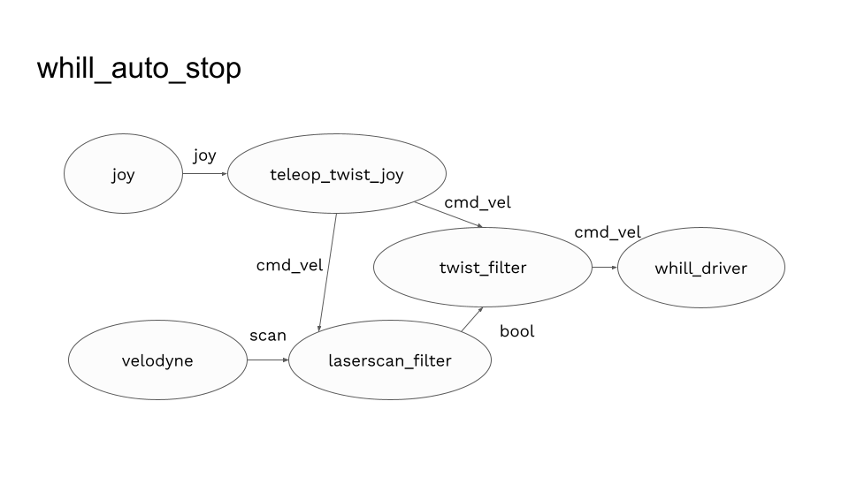

# whill_auto_stop

* 動作確認済みディストリビューション：Jazzy
* 追加ハードウェア：あり

TwistメッセージをSubscribeして走行します。その際、周囲の障害物に近づき過ぎたら停止するサンプルです。

ロボット台車にOuster（旧Velodyne）社製 VLP-16を搭載しています。

https://github.com/user-attachments/assets/d6be0824-2cd3-4a8c-8105-cd8a80746ce9

## ノード構成



## 使用方法

VLP-16の設定を必要に応じて変更します

* `config/VLP16-velodyne_driver_node-params.yaml`
* `config/VLP16-velodyne_transform_node-params.yaml`

`bringup_launch.py`を起動します

```
ros2 launch whill_auto_stop bringup_launch.py
```
